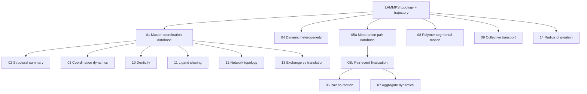

# Electrolyte MD Analysis

A modular Python/MDAnalysis workflow for extracting **coordination, ion-association, polymer-dynamics, and collective-transport mechanisms** from molecular-dynamics simulations of polymer electrolytes containing metal ions.

This repository provides the analysis workflow developed for long-timescale LAMMPS trajectories as a set of complete, standalone, metal-agnostic Python scripts. Metal identity is **not hard-coded**: selections, coordination cutoffs, charge number, and molar mass are user-defined inputs.

> The public repository contains analysis code and documentation only. Large trajectories, production databases, and system-specific research data are intentionally excluded.

## What this workflow analyzes

| Area | Analyses |
|---|---|
| **Coordination** | master coordination database, P/PT/T/F states, coordination numbers, denticity, chain sharing |
| **Coordination dynamics** | continuous/intermittent residence, state lifetimes, transitions, ligand exchange |
| **Ion association** | metal–anion pair persistence, pair reformation, co-motion, bridges and aggregates |
| **Networks** | cluster membership, connected components, giant-component proxy, lineage persistence |
| **Polymer dynamics** | EO-site sliding, interchain hopping, local segmental coupling, radius of gyration |
| **Transport** | MSD, non-Gaussian parameter, self van Hove functions, Onsager decomposition, exchange vs translation |

## Design

The central design is a **master coordination database** generated once from the trajectory and then reused by downstream structural and dynamical modules.



## Coordination-state definitions

The workflow uses four mutually exclusive metal-ion coordination states:

- **P** — coordinated to polymer oxygen(s), with no coordinating anion.
- **PT** — coordinated simultaneously to polymer oxygen(s) and anion(s).
- **T** — coordinated to anion(s), with no coordinating polymer oxygen.
- **F** — neither polymer nor anion coordination within the specified cutoffs.

The cutoffs are intentionally **not species-specific defaults**. Supply values appropriate to your system, preferably using the first minimum of the relevant radial distribution function.

## Repository structure

```text
electrolyte-md-analysis/
├── scripts/                    # complete standalone analysis codes
│   ├── 01_build_coordination_database.py
│   ├── 02_structural_summary.py
│   ├── 03_coordination_dynamics.py
│   ├── 04_dynamic_heterogeneity.py
│   ├── 05a_build_pair_database.py
│   ├── 05b_finalize_pair_database.py
│   ├── 06_pair_comotion.py
│   ├── 07_aggregate_dynamics.py
│   ├── 08_segmental_motion.py
│   ├── 09_collective_transport.py
│   ├── 10_denticity.py
│   ├── 11_ligand_sharing.py
│   ├── 12_network_topology.py
│   ├── 13_exchange_translation.py
│   └── 14_radius_of_gyration.py
├── src/electrolyte_md/         # small shared utilities used by tests
├── configs/example.yaml
├── examples/run_full_pipeline.sh
├── docs/
├── tests/
├── pyproject.toml
└── requirements.txt
```

## Installation

```bash
git clone https://github.com/USERNAME/electrolyte-md-analysis.git
cd electrolyte-md-analysis
python -m pip install -e .
```

Main dependencies are **MDAnalysis, NumPy, pandas, and Matplotlib**.

## Typical workflow

### 1. Build the master coordination database

Edit the generic `SYSTEMS` block in `coordination_database.py` (or adapt it to your paths) and set the metal/polymer and metal/anion cutoffs:

```bash
python scripts/01_build_coordination_database.py
```

The database records, for each metal ion and frame, polymer and anion contacts, chain identities, coordination numbers, denticity, P/PT/T/F state, bridging motifs, and cluster membership.

### 2. Structural and coordination dynamics

```bash
python scripts/02_structural_summary.py
python scripts/03_coordination_dynamics.py
```

These generate structural populations, block statistics, coordination distributions, residence lifetimes, survival functions, state transitions, and exchange frequencies.

### 3. Dynamic heterogeneity

```bash
python scripts/04_dynamic_heterogeneity.py
```

This module calculates metal/anion/cation MSDs, local MSD exponent, non-Gaussian parameter, self van Hove displacement distributions, and coordination-state-conditioned mobility.

### 4. Build and finalize the metal–anion pair database

```bash
python scripts/05a_build_pair_database.py \
    --topology system.data \
    --trajectory system.lammpsdump \
    --cutoff-A 4.0 \
    --overwrite

python scripts/05b_finalize_pair_database.py --overwrite
```

The first step tracks continuous pair events frame-by-frame. The finalization stage performs censoring-aware lifetime analysis, population convergence, survival probabilities, distance distributions, and pair-event summaries.

### 5. Pair co-motion and aggregate dynamics

```bash
python scripts/06_pair_comotion.py \
    --metal-mass-g-mol 40.0 \
    --overwrite

python scripts/07_aggregate_dynamics.py \
    --metal-mass-g-mol 40.0 \
    --metal-charge-number 1 \
    --overwrite
```

Metal mass and formal charge are runtime parameters used for mass-weighted center-of-mass and aggregate-charge quantities; neither identifies a species.

### 6. Polymer sliding and local segmental coupling

```bash
python scripts/08_segmental_motion.py \
    --topology system.data \
    --trajectory system.lammpsdump \
    --peo-cutoff 4.0 \
    --tfsi-cutoff 4.0 \
    --overwrite
```

This module identifies same-chain neighbor sliding, larger EO-site jumps, interchain hops, attachment/detachment events, and metal/local-polymer displacement correlations.

### 7. Collective ionic transport

```bash
python scripts/09_collective_transport.py
```

The module calculates collective Einstein-Helfand displacement correlations, Onsager terms, same-species self/distinct contributions, cross-species correlations, block uncertainties, and fit-window stability diagnostics. Optional Nernst-Einstein comparisons can be enabled by supplying self-diffusion coefficients in the module settings.

### 8. Database-derived structural analyses

```bash
python scripts/10_denticity.py --overwrite
python scripts/11_ligand_sharing.py --overwrite
python scripts/12_network_topology.py --overwrite
```

These quantify polymer/anion denticity, ligand sharing among multiple metal ions, aggregate topology, and component-size statistics.

### 9. Exchange versus translation

```bash
python scripts/13_exchange_translation.py \
    --topology system.data \
    --trajectory system.lammpsdump \
    --overwrite
```

This analysis asks whether translational motion occurs while retaining the coordination environment or is coupled to shell exchange/reorganization. It reports ligand retention, cumulative turnover, retention-conditioned MSD, and exchange-enhancement metrics.

### 10. Polymer radius of gyration

```bash
python scripts/14_radius_of_gyration.py \
    --topology system.data \
    --trajectory system.lammpsdump \
    --polymer-selection "resid 1:40"
```

## Generic metal-ion configuration

No named metal species is required by the public workflow. Important physical quantities are parameters:

```yaml
selections:
  metal: "type 17"
  polymer_oxygen: "resid 1:40 and type 4"
  anion_oxygen: "type 9"

coordination:
  metal_polymer_cutoff_A: 4.0
  metal_anion_cutoff_A: 4.0

metal_properties:
  charge_number: 1.0
  molar_mass_g_mol: 40.0
```

The values in `configs/example.yaml` are placeholders, not universal physical constants.

## Scientific principles preserved from the validated workflow

The portfolio refactor changes organization and interfaces, not the core analysis definitions. The standalone scripts retain the tested treatment of:

- periodic minimum-image displacements and trajectory unwrapping;
- continuous and intermittent contact lifetimes;
- P/PT/T/F state assignment and transition counting;
- polymer and anion denticity;
- metal–anion pair persistence and reformation;
- bridge and aggregate event tracking;
- pair and aggregate co-motion;
- non-Gaussian and van Hove diagnostics;
- collective transport / Onsager displacement correlations;
- coordination-shell retention and exchange-versus-translation analysis.

## Documentation

- [`docs/workflow.md`](docs/workflow.md) — module dependencies and recommended order
- [`docs/coordination_states.md`](docs/coordination_states.md) — coordination, denticity, sharing and bridge definitions
- [`docs/analysis_methods.md`](docs/analysis_methods.md) — dynamical and transport quantities
- [`docs/output_files.md`](docs/output_files.md) — principal output files
- [`docs/configuration.md`](docs/configuration.md) — adapting selections and physical parameters

## Testing

Run lightweight unit tests for the shared PBC and state-assignment utilities:

```bash
python -m pip install -e ".[dev]"
pytest
```

The original research scripts were already exercised on production trajectories. The repository tests focus on the reusable logic introduced during packaging.

## Skills demonstrated

**Python · MDAnalysis · NumPy · pandas · Matplotlib · LAMMPS trajectory analysis · periodic boundary conditions · scientific data pipelines · ion coordination · residence dynamics · graph/network analysis · polymer dynamics · collective transport · reproducible scientific computing**

## Citation / use

If this workflow contributes to published work, please cite the associated scientific publication or repository release when available.

## License

MIT License. See [`LICENSE`](LICENSE).